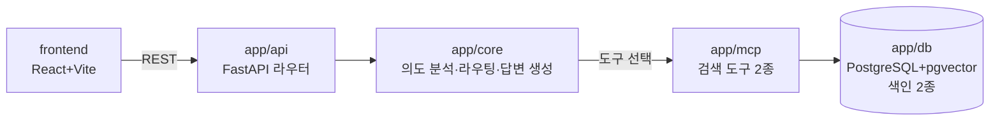

# ARCHITECTURE

## 요청 흐름

## 계층과 의존 방향

| 계층 | 순위 | 책임 | import 가능 |
|---|---|---|---|
| `app/api` | 3 | HTTP 입출력, 인증 정보 추출 | core, mcp, db |
| `app/core` | 2 | 의도 분석, 도구 선택, 답변 생성(LLM), 설정 | mcp, db |
| `app/mcp` | 1 | MCP 도구 정의, **도구 노출 필터** | db |
| `app/db` | 0 | 세션, 스키마, **검색 조회 필터(SQL)** | (없음) |

- 규칙: **자기보다 순위가 높은 계층을 import하지 않는다.**
- 예외: `app.core.config`(설정)는 모든 계층에서 import 가능.
- 강제: `backend/tests/structural/test_layers.py` (게이트 1)
- 왜: 권한의 마지막 방어선(SQL 필터)이 가장 아래 `db`에 있어야 위 계층 누구도 우회하지 못한다. db가 위 계층을 알면 필터가 호출 경로에 따라 달라질 수 있다.

## 권한 두 겹

1. **도구 노출** (`app/mcp`) — 역할에 없는 도구는 목록에서 뺀다. 목적: 비용·지연 절감.
2. **검색 조회 필터** (`app/db`) — 모든 검색 쿼리에 `scope`/`course` 조건. 목적: 실제 방어선.

## 결정 기록

→ [`docs/adr/`](docs/adr/)
